# AI Health Guide — Comprehensive Codebase Review

> **Author:** AI-Assisted Audit (Architect · Developer · Product Manager perspectives)  
> **Date:** June 2025  
> **Repository:** `AI-Health-Guide`  
> **Stack:** Python 3.14 / FastAPI · Next.js 14 / React 18 · Redis · Ollama (MedGemma) · OpenAI GPT-4o

---

## Table of Contents

1. [Executive Summary](#1-executive-summary)
2. [System Architecture Overview](#2-system-architecture-overview)
3. [Technology Stack](#3-technology-stack)
4. [Repository Structure](#4-repository-structure)
5. [Backend Deep Dive](#5-backend-deep-dive)
   - 5.1 [Configuration System](#51-configuration-system)
   - 5.2 [Data Models](#52-data-models)
   - 5.3 [Client Layer](#53-client-layer)
   - 5.4 [Agent Pipeline](#54-agent-pipeline)
   - 5.5 [Session Orchestrator](#55-session-orchestrator)
   - 5.6 [Deterministic Tools](#56-deterministic-tools)
   - 5.7 [API Layer (FastAPI)](#57-api-layer-fastapi)
   - 5.8 [Safety Architecture](#58-safety-architecture)
6. [Frontend Deep Dive](#6-frontend-deep-dive)
   - 6.1 [App Router & Pages](#61-app-router--pages)
   - 6.2 [Component Inventory](#62-component-inventory)
   - 6.3 [State Management (Zustand)](#63-state-management-zustand)
   - 6.4 [BFF Proxy Layer](#64-bff-proxy-layer)
   - 6.5 [Internationalization (i18n)](#65-internationalization-i18n)
   - 6.6 [PDF Generation](#66-pdf-generation)
   - 6.7 [Voice & Audio Pipeline](#67-voice--audio-pipeline)
7. [Data Flows](#7-data-flows)
   - 7.1 [Complete Consultation Flow](#71-complete-consultation-flow)
   - 7.2 [Message Processing Flow](#72-message-processing-flow)
   - 7.3 [Voice Input Flow](#73-voice-input-flow)
   - 7.4 [Image Upload Flow](#74-image-upload-flow)
   - 7.5 [Report Translation Flow](#75-report-translation-flow)
   - 7.6 [TTS Audio Flow](#76-tts-audio-flow)
8. [Authentication & Session Management](#8-authentication--session-management)
9. [Database & Persistence Schema](#9-database--persistence-schema)
10. [Design Patterns](#10-design-patterns)
11. [Feature Inventory (Product Manager View)](#11-feature-inventory-product-manager-view)
12. [Technical Debt & Observations](#12-technical-debt--observations)
13. [Security Posture](#13-security-posture)
14. [Testing Strategy](#14-testing-strategy)
15. [Deployment Architecture](#15-deployment-architecture)
16. [Appendices](#16-appendices)

---

## 1. Executive Summary

**AI Health Guide** is a multilingual, AI-powered clinical triage assistant designed to reduce clinic intake delays and overcome language barriers in healthcare settings. The system conducts structured medical interviews in 6 languages, performs deterministic triage classification, and generates dual reports (patient-facing + clinician SOAP note).

### Key Metrics

| Metric | Value |
|--------|-------|
| Backend LoC | ~2,700 lines Python |
| Frontend LoC | ~2,050 lines TypeScript/TSX |
| Documentation | ~3,500 lines across 3 design docs |
| Languages supported | 6 (EN, FR, ES, AR, JA, SW) |
| AI Agents | 9 (7 pipeline + 1 safety + 1 orchestrator) |
| API Endpoints | 12 REST (backend) + 13 BFF proxy (frontend) |
| React Components | 22 production components |
| Zustand Stores | 2 (session + UI) |

### Architecture in One Sentence

A **Next.js 14 BFF** proxies requests to a **FastAPI backend** that orchestrates a **6-stage clinical pipeline** using **local MedGemma (Ollama)** for clinical reasoning and **OpenAI GPT-4o** for reports/voice, with **Redis** for session persistence and a **deterministic triage matrix** ensuring safety-critical classifications never depend on LLM output.

---

## 2. System Architecture Overview

### High-Level Architecture

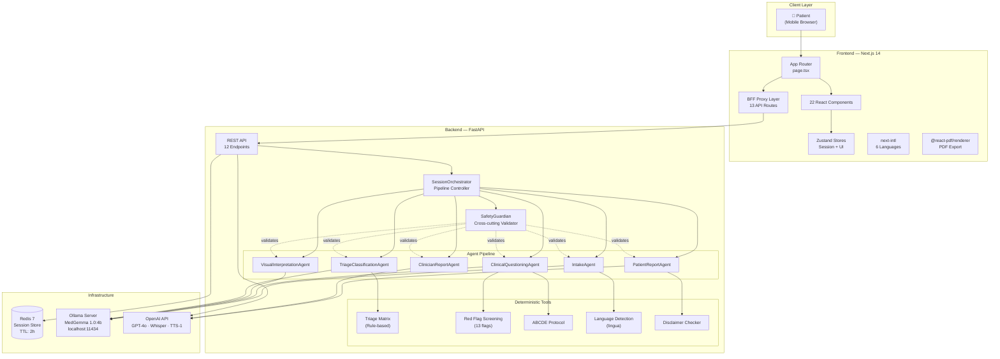
```mermaid
graph TB
    subgraph "Client Layer"
        Patient["👤 Patient<br/>(Mobile Browser)"]
    end

    subgraph "Frontend — Next.js 14"
        NextApp["App Router<br/>page.tsx"]
        BFF["BFF Proxy Layer<br/>13 API Routes"]
        Zustand["Zustand Stores<br/>Session + UI"]
        Components["22 React Components"]
        I18n["next-intl<br/>6 Languages"]
        PDF["@react-pdf/renderer<br/>PDF Export"]
    end

    subgraph "Backend — FastAPI"
        API["REST API<br/>12 Endpoints"]
        Orchestrator["SessionOrchestrator<br/>Pipeline Controller"]
        
        subgraph "Agent Pipeline"
            IntakeAg["IntakeAgent"]
            QuestionAg["ClinicalQuestioningAgent"]
            VisualAg["VisualInterpretationAgent"]
            TriageAg["TriageClassificationAgent"]
            PatientRpt["PatientReportAgent"]
            ClinRpt["ClinicianReportAgent"]
        end
        
        Safety["SafetyGuardian<br/>Cross-cutting Validator"]
        
        subgraph "Deterministic Tools"
            TriageMat["Triage Matrix<br/>(Rule-based)"]
            RedFlags["Red Flag Screening<br/>(13 flags)"]
            ABCDE["ABCDE Protocol"]
            LangDet["Language Detection<br/>(lingua)"]
            Disclaimer["Disclaimer Checker"]
        end
    end

    subgraph "Infrastructure"
        Redis[("Redis 7<br/>Session Store<br/>TTL: 2h")]
        Ollama["Ollama Server<br/>MedGemma 1.0:4b<br/>localhost:11434"]
        OpenAI["OpenAI API<br/>GPT-4o · Whisper · TTS-1"]
    end

    Patient --> NextApp
    NextApp --> Components
    Components --> Zustand
    NextApp --> BFF
    BFF --> API
    API --> Orchestrator
    Orchestrator --> IntakeAg & QuestionAg & VisualAg & TriageAg
    Orchestrator --> PatientRpt & ClinRpt
    Orchestrator --> Safety
    Safety -.->|validates| IntakeAg & QuestionAg & VisualAg & TriageAg & PatientRpt & ClinRpt
    TriageAg --> TriageMat
    QuestionAg --> RedFlags
    QuestionAg --> ABCDE
    IntakeAg --> LangDet
    PatientRpt --> Disclaimer
    API --> Redis
    IntakeAg & QuestionAg & VisualAg & TriageAg --> Ollama
    PatientRpt & ClinRpt --> OpenAI
    API --> OpenAI
```

### Model Responsibility Split

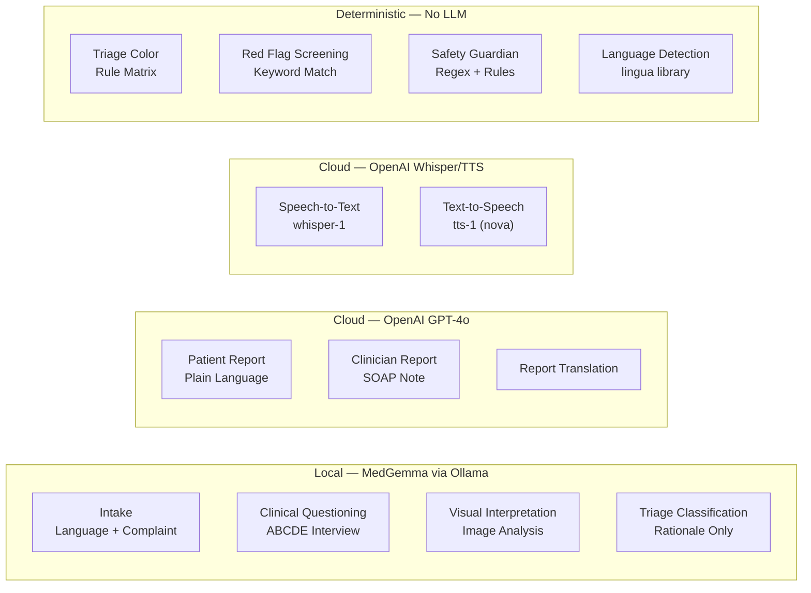
```mermaid
graph LR
    subgraph "Local — MedGemma via Ollama"
        A1["Intake<br/>Language + Complaint"]
        A2["Clinical Questioning<br/>ABCDE Interview"]
        A3["Visual Interpretation<br/>Image Analysis"]
        A4["Triage Classification<br/>Rationale Only"]
    end
    
    subgraph "Cloud — OpenAI GPT-4o"
        A5["Patient Report<br/>Plain Language"]
        A6["Clinician Report<br/>SOAP Note"]
        A7["Report Translation"]
    end
    
    subgraph "Cloud — OpenAI Whisper/TTS"
        A8["Speech-to-Text<br/>whisper-1"]
        A9["Text-to-Speech<br/>tts-1 (nova)"]
    end
    
    subgraph "Deterministic — No LLM"
        D1["Triage Color<br/>Rule Matrix"]
        D2["Red Flag Screening<br/>Keyword Match"]
        D3["Safety Guardian<br/>Regex + Rules"]
        D4["Language Detection<br/>lingua library"]
    end
```

---

## 3. Technology Stack

### Backend

| Layer | Technology | Version | Purpose |
|-------|-----------|---------|---------|
| **Runtime** | Python | 3.14 | Core language |
| **Framework** | FastAPI | ≥0.111.0 | REST API + async |
| **Server** | Uvicorn | ≥0.29.0 | ASGI server |
| **Validation** | Pydantic v2 | ≥2.0.0 | Data models + settings |
| **Session Store** | Redis (aioredis) | ≥5.0.0 | Async session persistence |
| **Local LLM** | Ollama + MedGemma | 1.0:4b | Clinical reasoning (on-device) |
| **Cloud LLM** | OpenAI GPT-4o | ≥1.30.0 | Reports, translation |
| **STT** | OpenAI Whisper | whisper-1 | Speech transcription |
| **TTS** | OpenAI TTS | tts-1 (nova) | Audio synthesis |
| **Language ID** | lingua | ≥2.0.0 | Offline language detection |
| **HTTP Client** | httpx | ≥0.27.0 | Ollama communication |
| **Testing** | pytest + pytest-asyncio | ≥8.0 / ≥0.23 | Unit + integration tests |

### Frontend

| Layer | Technology | Version | Purpose |
|-------|-----------|---------|---------|
| **Framework** | Next.js (App Router) | 14.2.35 | SSR + routing + BFF |
| **UI Library** | React | ^18 | Component rendering |
| **Language** | TypeScript | ^5 | Type safety |
| **State** | Zustand | ^5.0.12 | Client state management |
| **Styling** | Tailwind CSS | ^3.4.1 | Utility-first CSS |
| **i18n** | next-intl | ^4.8.3 | 6-language translations (UI labels) |
| **PDF** | @react-pdf/renderer | ^4.3.2 | Client-side PDF generation |
| **Testing** | Vitest / Playwright | ^4.1 / ^1.58 | Unit / E2E testing |
| **Utilities** | clsx + tailwind-merge | — | className composition |

### Infrastructure

| Service | Technology | Configuration |
|---------|-----------|--------------|
| **Session Store** | Redis 7 Alpine (Docker) | Port 6379, no password (dev), TTL 7200s |
| **Local LLM** | Ollama | Port 11434, model `MedAIBase/MedGemma1.0:4b` |
| **Source Control** | Git | .gitignore present |

---

## 4. Repository Structure

```
AI-Health-Guide/
├── .env                                # Environment variables (API keys, config)
├── requirements.txt                    # Python dependencies (14 packages)
├── pytest.ini                          # Test configuration
├── AI_HEALTH_GUIDE_PROJECT.md          # Backend design document
├── AI_HEALTH_GUIDE_FRONTEND.md         # Frontend design document
├── PROJECT_BLUEPRINT.md                # Integrated architecture blueprint
│
├── ai_health_guide/                    # ── Python Backend Package ──
│   ├── __init__.py
│   ├── config.py                       # AppConfig (pydantic-settings)
│   ├── main.py                         # FastAPI app (12 endpoints, lifespan)
│   ├── orchestrator.py                 # SessionOrchestrator (pipeline controller)
│   │
│   ├── models/                         # Pydantic v2 data models
│   │   ├── __init__.py
│   │   ├── session.py                  # SessionState, Stage, Message, Location, Facility
│   │   ├── clinical.py                 # TriageColor, RedFlag, ABCDEAssessment, TriageResult
│   │   ├── report.py                   # PatientReport, SOAPNote, FinalReport
│   │   └── safety.py                   # SafetyCheckResult
│   │
│   ├── agents/                         # AI agent implementations
│   │   ├── __init__.py
│   │   ├── base.py                     # BaseAgent ABC
│   │   ├── intake_agent.py             # Language detection + complaint extraction
│   │   ├── clinical_questioning_agent.py # ABCDE multi-turn interview
│   │   ├── visual_interpretation_agent.py # Multimodal image analysis
│   │   ├── triage_classification_agent.py # Triage rationale (color from matrix)
│   │   ├── patient_report_agent.py     # GPT-4o patient report
│   │   ├── clinician_report_agent.py   # GPT-4o SOAP note
│   │   ├── care_navigation_agent.py    # Facility recommendation
│   │   └── safety_guardian.py          # Cross-cutting safety validator
│   │
│   ├── clients/                        # External service wrappers
│   │   ├── __init__.py
│   │   ├── medgemma_client.py          # Ollama HTTP client
│   │   ├── openai_client.py            # OpenAI GPT-4o wrapper
│   │   ├── redis_client.py             # Redis async session store
│   │   ├── voice_input.py              # Whisper STT
│   │   └── voice_output.py             # OpenAI TTS
│   │
│   ├── tools/                          # Deterministic utilities
│   │   ├── __init__.py
│   │   ├── triage_matrix.py            # Rule-based RED/YELLOW/GREEN
│   │   ├── red_flag_screening.py       # 13-flag keyword database
│   │   ├── abcde_protocol.py           # Clinical interview framework
│   │   ├── language_detection.py       # lingua wrapper
│   │   ├── disclaimer_checker.py       # Mandatory disclaimer validation
│   │   ├── soap_formatter.py           # SOAP note structure enforcer
│   │   └── google_maps.py              # Google Maps Places + Directions (active)
│   │
│   ├── prompts/                        # System prompt templates
│   │   ├── intake.txt
│   │   ├── questioning.txt
│   │   ├── visual.txt
│   │   ├── triage.txt
│   │   ├── patient_report.txt
│   │   ├── clinician_report.txt
│   │   ├── safety_guardian.txt
│   │   └── navigation.txt
│   │
│   └── tests/                          # Backend test suite
│       ├── __init__.py
│       ├── test_triage_matrix.py       # Triage decision logic (11 tests)
│       ├── test_red_flags.py           # Red flag detection (13 tests)
│       ├── test_session_flow.py        # Session state transitions (10 tests)
│       └── test_safety_guardian.py     # Safety validation rules (6 tests)
│
└── ai-health-guide-frontend/           # ── Next.js 14 Frontend ──
    ├── package.json                    # Dependencies + scripts
    ├── tsconfig.json                   # TypeScript strict mode
    ├── tailwind.config.ts              # Tailwind theme
    ├── next.config.mjs                 # Next.js configuration
    ├── postcss.config.mjs
    ├── .env.local                      # BACKEND_URL
    ├── .gitignore
    │
    ├── app/
    │   ├── layout.tsx                  # Root layout (Geist fonts, metadata)
    │   ├── page.tsx                    # Main SPA (174 lines, stage router)
    │   ├── globals.css                 # Tailwind base + dark mode
    │   └── api/                        # BFF proxy routes
    │       └── sessions/
    │           ├── route.ts            # POST: create session
    │           └── [id]/
    │               ├── route.ts        # GET: poll session
    │               ├── messages/route.ts
    │               ├── voice/route.ts
    │               ├── image/route.ts
    │               ├── language/route.ts
    │               ├── location/route.ts
    │               ├── skip-location/route.ts
    │               └── report/
    │                   ├── route.ts
    │                   ├── tts/route.ts
    │                   └── translate/
    │                       ├── route.ts
    │                       └── tts/route.ts
    │
    ├── components/
    │   ├── home/
    │   │   └── HomePage.tsx            # Full landing page (hero, features, how-it-works,
    │   │                               #   agent orchestration, testimonials, about, footer)
    │   ├── shell/
    │   │   ├── Header.tsx              # Sticky header, stage badge, locale, go-home logo
    │   │   ├── StageProgressBar.tsx    # 5-step progress with labels
    │   │   └── AgentActivityPanel.tsx  # Real-time agent pipeline status during processing
    │   ├── chat/
    │   │   ├── ChatWindow.tsx          # Message list, auto-scroll, typing dots
    │   │   └── ChatInputBar.tsx        # Text + voice + language switcher
    │   ├── stages/
    │   │   ├── WelcomeScreen.tsx       # Language cards + disclaimer
    │   │   ├── IntakeScreen.tsx        # Loading spinner
    │   │   └── ImageUploadScreen.tsx   # Drag-drop + preview
    │   ├── triage/
    │   │   └── TriageCard.tsx          # Color-coded urgency banner + TTS
    │   ├── report/
    │   │   ├── ReportView.tsx          # Tabs, translation, TTS, PDF
    │   │   ├── NearbyFacilities.tsx    # Geolocation + facility list + Google Maps directions
    │   │   ├── PatientReportDocument.tsx
    │   │   └── TranslatedReportDocument.tsx
    │   └── ui/
    │       ├── Button.tsx              # 4 variants, 3 sizes
    │       ├── Card.tsx                # Header/Body/Footer
    │       ├── Spinner.tsx             # 3 sizes
    │       └── TriageBadge.tsx         # Color pill + pulse
    │
    ├── store/
    │   └── index.ts                    # useSessionStore + useUIStore
    │
    ├── hooks/
    │   ├── useCreateSession.ts         # Session creation
    │   └── useSessionPolling.ts        # 2s interval polling
    │
    ├── lib/
    │   ├── proxy.ts                    # BFF request forwarding
    │   └── utils.ts                    # cn() — Tailwind class merge
    │
    ├── types/
    │   └── session.ts                  # TS mirrors of Pydantic models
    │
    └── messages/                       # i18n translation bundles
        ├── en.json
        ├── fr.json
        ├── es.json
        ├── ar.json
        ├── ja.json
        └── sw.json
```

---

## 5. Backend Deep Dive

### 5.1 Configuration System

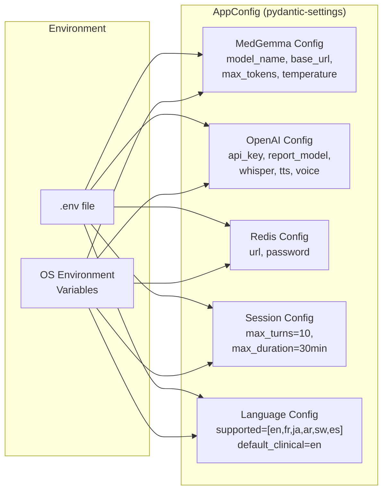
```mermaid
graph LR
    subgraph "Environment"
        ENV[".env file"]
        OS["OS Environment<br/>Variables"]
    end
    
    subgraph "AppConfig (pydantic-settings)"
        MC["MedGemma Config<br/>model_name, base_url,<br/>max_tokens, temperature"]
        OC["OpenAI Config<br/>api_key, report_model,<br/>whisper, tts, voice"]
        RC["Redis Config<br/>url, password"]
        SC["Session Config<br/>max_turns=10,<br/>max_duration=30min"]
        LC["Language Config<br/>supported=[en,fr,ja,ar,sw,es]<br/>default_clinical=en"]
    end
    
    ENV --> MC & OC & RC & SC & LC
    OS --> MC & OC & RC & SC & LC
```

**Key configuration values:**

| Field | Default | Description |
|-------|---------|-------------|
| `medgemma_model_name` | `MedAIBase/MedGemma1.0:4b` | Ollama model ID |
| `medgemma_ollama_base_url` | `http://localhost:11434` | Ollama server |
| `medgemma_max_tokens` | `4096` | Max output tokens |
| `medgemma_temperature` | `0.3` | Low for clinical precision |
| `openai_report_model` | `gpt-4o` | Report generation model |
| `whisper_model` | `whisper-1` | STT model |
| `tts_model` / `tts_voice` | `tts-1` / `nova` | TTS configuration |
| `max_questioning_turns` | `10` | Interview turn limit |
| `redis_url` | `redis://localhost:6379` | Redis connection |
| `supported_languages` | `["en","fr","ja","ar","sw","es"]` | Supported locales |

### 5.2 Data Models

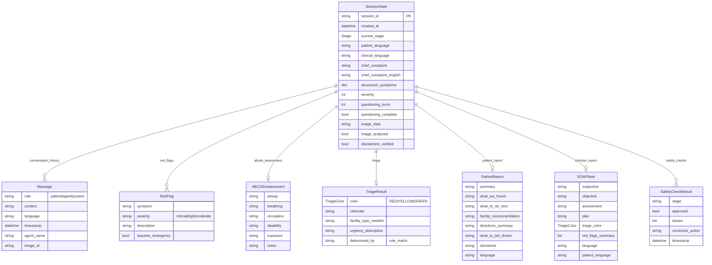
```mermaid
erDiagram
    SessionState ||--o{ Message : "conversation_history"
    SessionState ||--o{ RedFlag : "red_flags"
    SessionState ||--o| ABCDEAssessment : "abcde_assessment"
    SessionState ||--o| TriageResult : "triage"
    SessionState ||--o| PatientReport : "patient_report"
    SessionState ||--o| SOAPNote : "clinician_report"
    SessionState ||--o{ SafetyCheckResult : "safety_checks"
    
    SessionState {
        string session_id PK
        datetime created_at
        Stage current_stage
        string patient_language
        string clinical_language
        string chief_complaint
        string chief_complaint_english
        dict structured_symptoms
        int severity
        int questioning_turns
        bool questioning_complete
        string image_data
        bool image_analyzed
        bool disclaimers_verified
    }
    
    Message {
        string role "patient|agent|system"
        string content
        string language
        datetime timestamp
        string agent_name
        string image_id
    }
    
    RedFlag {
        string symptom
        string severity "critical|high|moderate"
        string description
        bool requires_emergency
    }
    
    ABCDEAssessment {
        string airway
        string breathing
        string circulation
        string disability
        string exposure
        string notes
    }
    
    TriageResult {
        TriageColor color "RED|YELLOW|GREEN"
        string rationale
        string facility_type_needed
        string urgency_description
        string determined_by "rule_matrix"
    }
    
    PatientReport {
        string summary
        string what_we_found
        string what_to_do_next
        string facility_recommendation
        string directions_summary
        string what_to_tell_doctor
        string disclaimer
        string language
    }
    
    SOAPNote {
        string subjective
        string objective
        string assessment
        string plan
        TriageColor triage_color
        list red_flags_summary
        string language
        string patient_language
    }
    
    SafetyCheckResult {
        string stage
        bool approved
        list issues
        string corrective_action
        datetime timestamp
    }
```

**Stage Enum values:**

```
INTAKE → QUESTIONING → VISUAL (optional) → TRIAGE → REPORT → COMPLETE
```

### 5.3 Client Layer

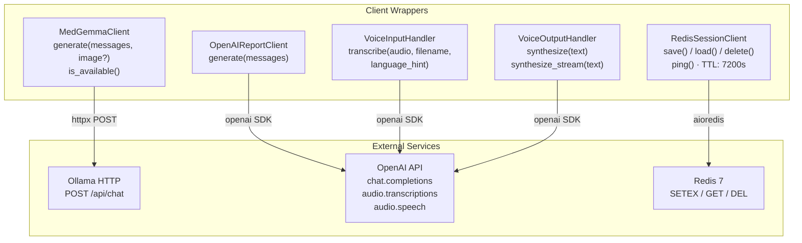
```mermaid
graph TB
    subgraph "Client Wrappers"
        MG["MedGemmaClient<br/>generate(messages, image?)<br/>is_available()"]
        OAI["OpenAIReportClient<br/>generate(messages)"]
        RDS["RedisSessionClient<br/>save() / load() / delete()<br/>ping() · TTL: 7200s"]
        VI["VoiceInputHandler<br/>transcribe(audio, filename,<br/>language_hint)"]
        VO["VoiceOutputHandler<br/>synthesize(text)<br/>synthesize_stream(text)"]
    end
    
    subgraph "External Services"
        Ollama["Ollama HTTP<br/>POST /api/chat"]
        OpenAI["OpenAI API<br/>chat.completions<br/>audio.transcriptions<br/>audio.speech"]
        Redis["Redis 7<br/>SETEX / GET / DEL"]
    end
    
    MG -->|httpx POST| Ollama
    OAI -->|openai SDK| OpenAI
    VI -->|openai SDK| OpenAI
    VO -->|openai SDK| OpenAI
    RDS -->|aioredis| Redis
```

**MedGemmaClient** communicates with Ollama over HTTP:
- Endpoint: `POST {base_url}/api/chat`
- Payload: `{"model": model_name, "messages": [...], "stream": false, "options": {"temperature": 0.3, "num_predict": 4096}}`
- Multimodal: Image sent as base64 in message content `"images": [base64_str]`

**RedisSessionClient** key design:
- Key format: `session:{uuid4}`
- Value: Full `SessionState.model_dump_json()`
- TTL: 7200 seconds (2 hours), reset on every save
- Async via `redis.asyncio`

### 5.4 Agent Pipeline

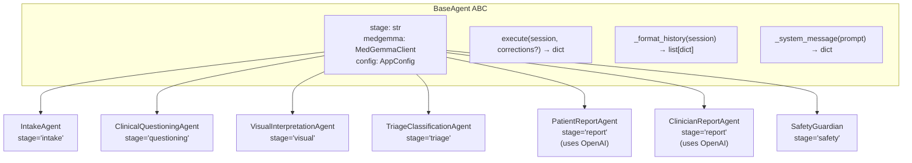
```mermaid
graph TD
    subgraph "BaseAgent ABC"
        BA["stage: str<br/>medgemma: MedGemmaClient<br/>config: AppConfig"]
        BA_M1["execute(session, corrections?) → dict"]
        BA_M2["_format_history(session) → list[dict]"]
        BA_M3["_system_message(prompt) → dict"]
    end
    
    BA --> IA["IntakeAgent<br/>stage='intake'"]
    BA --> CQA["ClinicalQuestioningAgent<br/>stage='questioning'"]
    BA --> VIA["VisualInterpretationAgent<br/>stage='visual'"]
    BA --> TCA["TriageClassificationAgent<br/>stage='triage'"]
    BA --> PRA["PatientReportAgent<br/>stage='report'<br/>(uses OpenAI)"]
    BA --> CRA["ClinicianReportAgent<br/>stage='report'<br/>(uses OpenAI)"]
    BA --> SG["SafetyGuardian<br/>stage='safety'"]
```

| Agent | Model | Key Output Fields | Special Behavior |
|-------|-------|-------------------|-----------------|
| **IntakeAgent** | MedGemma (local) | `chief_complaint`, `chief_complaint_english`, `patient_language` | Detects language via lingua |
| **ClinicalQuestioningAgent** | MedGemma (local) | `severity`, `structured_symptoms`, `red_flags`, `abcde_assessment`, `questioning_complete` | Multi-turn (max 10), screens red flags per turn |
| **VisualInterpretationAgent** | MedGemma (multimodal) | `visual_observations`, `image_analyzed` | Base64 image input, no diagnosis |
| **TriageClassificationAgent** | MedGemma (rationale) | `triage` (TriageResult) | Color comes from deterministic matrix, NOT LLM |
| **PatientReportAgent** | GPT-4o (cloud) | `patient_report` (PatientReport) | Plain language, patient's language, includes disclaimer |
| **ClinicianReportAgent** | GPT-4o (cloud) | `clinician_report` (SOAPNote) | Clinical SOAP format, always in English |
| **SafetyGuardian** | None (rules-based) | `SafetyCheckResult` | Cross-cutting; validates all stage outputs |

### 5.5 Session Orchestrator

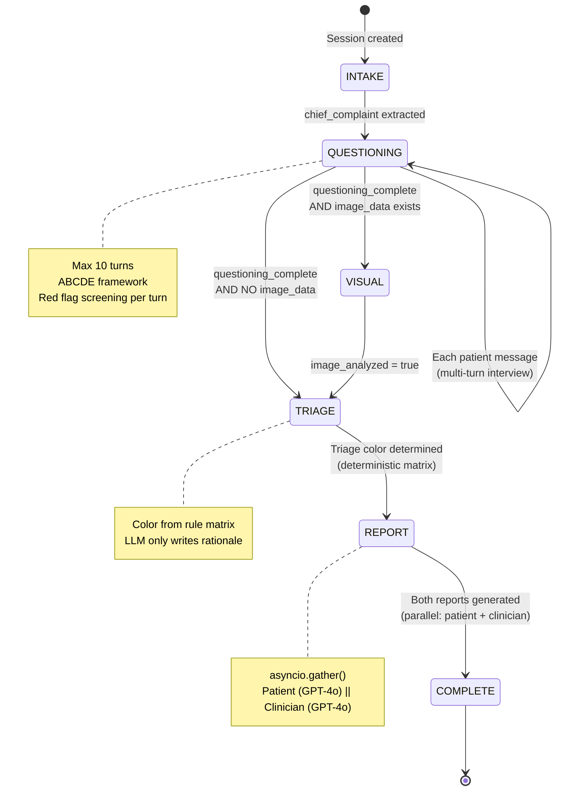
```mermaid
stateDiagram-v2
    [*] --> INTAKE : Session created
    
    INTAKE --> QUESTIONING : chief_complaint extracted
    
    QUESTIONING --> QUESTIONING : Each patient message<br/>(multi-turn interview)
    QUESTIONING --> VISUAL : questioning_complete<br/>AND image_data exists
    QUESTIONING --> TRIAGE : questioning_complete<br/>AND NO image_data
    
    VISUAL --> TRIAGE : image_analyzed = true
    
    TRIAGE --> REPORT : Triage color determined<br/>(deterministic matrix)
    
    REPORT --> COMPLETE : Both reports generated<br/>(parallel: patient + clinician)
    
    COMPLETE --> [*]
    
    note right of QUESTIONING
        Max 10 turns
        ABCDE framework
        Red flag screening per turn
    end note
    
    note right of TRIAGE
        Color from rule matrix
        LLM only writes rationale
    end note
    
    note right of REPORT
        asyncio.gather()
        Patient (GPT-4o) || Clinician (GPT-4o)
    end note
```

**Orchestrator methods:**

| Method | Purpose |
|--------|---------|
| `process_message(session, user_content)` | Main entry: append message → safety check → run agent → advance stage |
| `_run_stage_agent(session)` | Execute agent with retry loop (max 2 retries on safety rejection) |
| `_advance_stage_if_ready(session)` | Evaluate completion conditions → transition |
| `_run_triage_and_onward(session)` | Run triage → parallel reports → COMPLETE |
| `_run_parallel_reports(session)` | `asyncio.gather(patient_report, clinician_report)` |
| `process_image_and_continue(session)` | After image upload: VISUAL → TRIAGE → REPORT |

**Safety retry loop (pseudocode):**

```
for attempt in range(MAX_SAFETY_RETRIES + 1):            # MAX_SAFETY_RETRIES = 2
    output = await agent.execute(session, corrections)
    safety = await safety_guardian.validate(session, output)
    if safety.approved:
        merge output → session
        break
    else:
        corrections = safety.issues                       # feed back for retry
else:
    log and skip (don't merge unsafe output)              # hard fail after 3 attempts
```

### 5.6 Deterministic Tools

#### Triage Decision Matrix

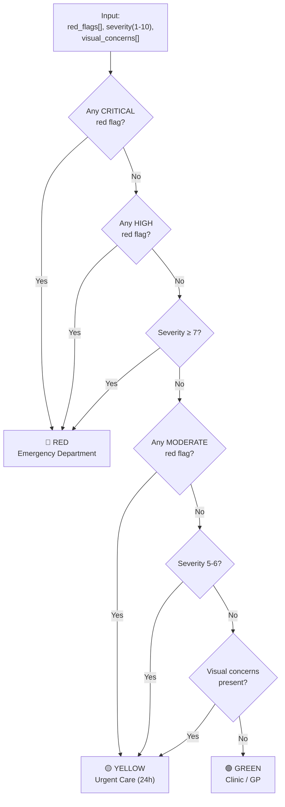
```mermaid
graph TD
    Input["Input:<br/>red_flags[], severity(1-10),<br/>visual_concerns[]"]
    
    Input --> C1{"Any CRITICAL<br/>red flag?"}
    C1 -->|Yes| RED["🔴 RED<br/>Emergency Department"]
    C1 -->|No| C2{"Any HIGH<br/>red flag?"}
    C2 -->|Yes| RED
    C2 -->|No| C3{"Severity ≥ 7?"}
    C3 -->|Yes| RED
    C3 -->|No| C4{"Any MODERATE<br/>red flag?"}
    C4 -->|Yes| YELLOW["🟡 YELLOW<br/>Urgent Care (24h)"]
    C4 -->|No| C5{"Severity 5-6?"}
    C5 -->|Yes| YELLOW
    C5 -->|No| C6{"Visual concerns<br/>present?"}
    C6 -->|Yes| YELLOW
    C6 -->|No| GREEN["🟢 GREEN<br/>Clinic / GP"]
```

**This is the AUTHORITATIVE triage source — the LLM only provides a rationale text, never the classification color.**

#### Red Flag Database (13 entries)

| Severity | Count | Flags |
|----------|-------|-------|
| **CRITICAL** | 7 | Chest pain, difficulty breathing, sudden severe headache, stroke symptoms, loss of consciousness, suicidal ideation, severe bleeding |
| **HIGH** | 3 | High fever + stiff neck, severe abdominal pain, allergic reaction |
| **MODERATE** | 3 | High fever, severe dehydration, vomiting blood |

### 5.7 API Layer (FastAPI)

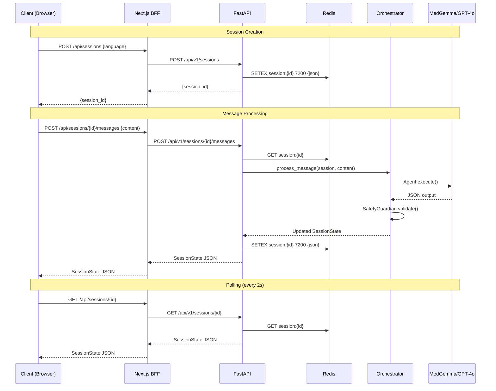
```mermaid
sequenceDiagram
    participant C as Client (Browser)
    participant BFF as Next.js BFF
    participant API as FastAPI
    participant R as Redis
    participant O as Orchestrator
    participant LLM as MedGemma/GPT-4o

    Note over C,LLM: Session Creation
    C->>BFF: POST /api/sessions {language}
    BFF->>API: POST /api/v1/sessions
    API->>R: SETEX session:{id} 7200 {json}
    API-->>BFF: {session_id}
    BFF-->>C: {session_id}

    Note over C,LLM: Message Processing
    C->>BFF: POST /api/sessions/{id}/messages {content}
    BFF->>API: POST /api/v1/sessions/{id}/messages
    API->>R: GET session:{id}
    API->>O: process_message(session, content)
    O->>LLM: Agent.execute()
    LLM-->>O: JSON output
    O->>O: SafetyGuardian.validate()
    O-->>API: Updated SessionState
    API->>R: SETEX session:{id} 7200 {json}
    API-->>BFF: SessionState JSON
    BFF-->>C: SessionState JSON

    Note over C,LLM: Polling (every 2s)
    C->>BFF: GET /api/sessions/{id}
    BFF->>API: GET /api/v1/sessions/{id}
    API->>R: GET session:{id}
    API-->>BFF: SessionState JSON
    BFF-->>C: SessionState JSON
```

**All 12 Endpoints:**

| Method | Path | Request | Response |
|--------|------|---------|----------|
| GET | `/health` | — | `{status, redis}` |
| POST | `/api/v1/sessions` | `{language}` | `{session_id}` |
| GET | `/api/v1/sessions/{id}` | — | `SessionState` |
| PATCH | `/api/v1/sessions/{id}/language` | `{language}` | `SessionState` |
| POST | `/api/v1/sessions/{id}/messages` | `{content, language?}` | `SessionState` |
| POST | `/api/v1/sessions/{id}/voice` | `FormData(audio)` | `SessionState` |
| POST | `/api/v1/sessions/{id}/image` | `FormData(image)` | `SessionState` |
| GET | `/api/v1/sessions/{id}/report` | — | `{patient_report, clinician_report, triage}` |
| GET | `/api/v1/sessions/{id}/report/tts` | — | `audio/mpeg` stream |
| POST | `/api/v1/sessions/{id}/report/translate` | `{language}` | Translated report JSON |
| POST | `/api/v1/sessions/{id}/report/translate/tts` | `{text}` | `audio/mpeg` stream |
| DELETE | `/api/v1/sessions/{id}` | — | `{status}` |

### 5.8 Safety Architecture

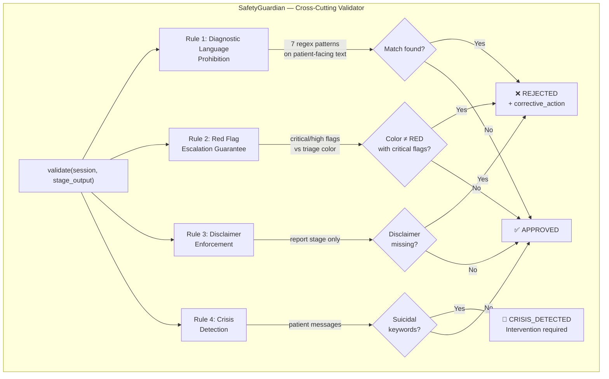
```mermaid
graph TD
    subgraph "SafetyGuardian — Cross-Cutting Validator"
        V["validate(session, stage_output)"]
        
        V --> R1["Rule 1: Diagnostic Language<br/>Prohibition"]
        V --> R2["Rule 2: Red Flag<br/>Escalation Guarantee"]
        V --> R3["Rule 3: Disclaimer<br/>Enforcement"]
        V --> R4["Rule 4: Crisis<br/>Detection"]
        
        R1 -->|"7 regex patterns<br/>on patient-facing text"| Check1{"Match found?"}
        R2 -->|"critical/high flags<br/>vs triage color"| Check2{"Color ≠ RED<br/>with critical flags?"}
        R3 -->|"report stage only"| Check3{"Disclaimer<br/>missing?"}
        R4 -->|"patient messages"| Check4{"Suicidal<br/>keywords?"}
        
        Check1 -->|Yes| REJECT["❌ REJECTED<br/>+ corrective_action"]
        Check2 -->|Yes| REJECT
        Check3 -->|Yes| REJECT
        Check4 -->|Yes| CRISIS["🚨 CRISIS_DETECTED<br/>Intervention required"]
        
        Check1 -->|No| PASS
        Check2 -->|No| PASS
        Check3 -->|No| PASS
        Check4 -->|No| PASS
        
        PASS["✅ APPROVED"]
    end
```

**FORBIDDEN_PATTERNS (7 regex):**
```
"you have \w+ (?:disease|syndrome|disorder|infection|condition)"
"this is \w+ disease"
"you are suffering from"
"diagnosis:\s*\w+"
"you definitely have"
"you probably have"
"i diagnose"
```

**Crisis keywords:** `"want to die"`, `"kill myself"`, `"end my life"`, `"suicide"`, `"self-harm"`, `"hurt myself"`

---

## 6. Frontend Deep Dive

### 6.1 App Router & Pages

The frontend is essentially a **single-page application** inside Next.js App Router. The one `page.tsx` acts as a stage router with a landing page:

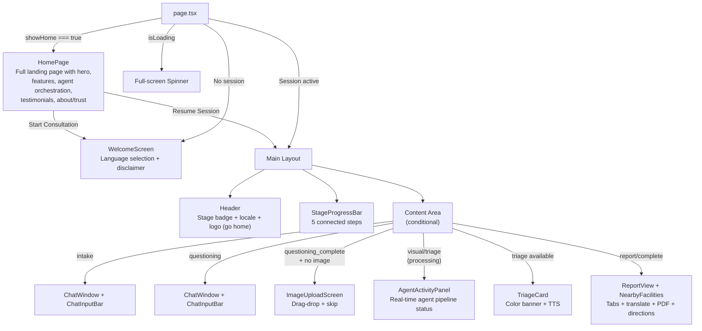
```mermaid
graph TD
    Page["page.tsx"]
    
    Page -->|"showHome === true"| HP["HomePage<br/>Full landing page with hero,<br/>features, agent orchestration,<br/>testimonials, about/trust"]
    HP -->|"Start Consultation"| WS
    HP -->|"Resume Session"| Layout
    
    Page -->|"No session"| WS["WelcomeScreen<br/>Language selection + disclaimer"]
    Page -->|"isLoading"| SP["Full-screen Spinner"]
    
    Page -->|"Session active"| Layout["Main Layout"]
    Layout --> Header["Header<br/>Stage badge + locale + logo (go home)"]
    Layout --> Progress["StageProgressBar<br/>5 connected steps"]
    Layout --> Content["Content Area<br/>(conditional)"]
    
    Content -->|"intake"| Chat1["ChatWindow + ChatInputBar"]
    Content -->|"questioning"| Chat2["ChatWindow + ChatInputBar"]
    Content -->|"questioning_complete<br/>+ no image"| IMG["ImageUploadScreen<br/>Drag-drop + skip"]
    Content -->|"visual/triage<br/>(processing)"| AAP["AgentActivityPanel<br/>Real-time agent pipeline status"]
    Content -->|"triage available"| TC["TriageCard<br/>Color banner + TTS"]
    Content -->|"report/complete"| RV["ReportView + NearbyFacilities<br/>Tabs + translate + PDF + directions"]
```

### 6.2 Component Inventory

| Component | Lines | Props | Key Features |
|-----------|-------|-------|-------------|
| **HomePage** | ~700 | `hasActiveSession, onStartConsultation, onResumeConsultation` | Full landing page: hero, features, how-it-works, agent orchestration with scenario-driven animation (3 patient personas), testimonials, about/trust, footer, resume banner |
| **Header** | 48 | `stage, onNewConsultation?, onGoHome?` | Sticky, stage badge, locale, clickable logo to return home |
| **StageProgressBar** | 99 | `currentStage` | 5 steps, clickable completed steps, question counter |
| **AgentActivityPanel** | ~80 | `currentStage, hasTriage, hasReport, safetyChecks` | Real-time agent pipeline display (Visual/Triage/Report), animated dots, replaces generic spinners |
| **ChatWindow** | 76 | `messages[], isTyping?` | Auto-scroll, typing indicator (3 dots), message bubbles |
| **ChatInputBar** | 255 | `sessionId, onMessageSent, disabled?` | Text input, voice recording, language switcher (6 langs) |
| **WelcomeScreen** | 65 | `onStart, isLoading?` | 6 language cards (native names), disclaimer |
| **ImageUploadScreen** | 115 | `sessionId, onUploaded, onSkip` | Drag-drop, preview, upload/skip buttons |
| **IntakeScreen** | 30 | `stageLabel?` | Loading spinner |
| **NearbyFacilities** | ~100 | `sessionId, facilities, directions, patientLocation, onUpdated` | Geolocation sharing, facility cards with distance/rating, Google Maps external direction links, skip option |
| **TriageCard** | 80 | `triage, sessionId` | Color-coded banner (RED/YELLOW/GREEN), TTS button |
| **ReportView** | 346 | `sessionId, patientReport, clinicianReport, triageColor` | Tabs, translate, TTS, PDF download |
| **PatientReportDocument** | 97 | `report, triageColor` | @react-pdf A4 layout |
| **TranslatedReportDocument** | 112 | `report, triageColor` | @react-pdf with "Translated to {lang}" |
| **Button** | 71 | `variant, size, isLoading` | 4 variants (primary, secondary, outline, ghost), 3 sizes |
| **Card** | 39 | `className` | Header/Body/Footer composition |
| **Spinner** | 27 | `size, className` | sm/md/lg animated |
| **TriageBadge** | 56 | `color, showLabel?, className` | Pulsing dot for RED |

### 6.3 State Management (Zustand)

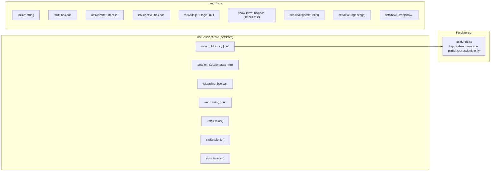
```mermaid
graph LR
    subgraph "useSessionStore (persisted)"
        SS_ID["sessionId: string | null"]
        SS_S["session: SessionState | null"]
        SS_L["isLoading: boolean"]
        SS_E["error: string | null"]
        SS_A1["setSession()"]
        SS_A2["setSessionId()"]
        SS_A3["clearSession()"]
    end
    
    subgraph "useUIStore"
        UI_L["locale: string"]
        UI_R["isRtl: boolean"]
        UI_P["activePanel: UIPanel"]
        UI_M["isMicActive: boolean"]
        UI_VS["viewStage: Stage | null"]
        UI_SH["showHome: boolean (default true)"]
        UI_A1["setLocale(locale, isRtl)"]
        UI_A2["setViewStage(stage)"]
        UI_A3["setShowHome(show)"]
    end
    
    subgraph "Persistence"
        LS["localStorage<br/>key: 'ai-health-session'<br/>partialize: sessionId only"]
    end
    
    SS_ID --> LS
```

**Key design decisions:**
- Only `sessionId` is persisted to localStorage (full session re-fetched on reload)
- `viewStage` allows reviewing completed stages without navigating back
- `showHome` controls landing page visibility (default `true`); set to `false` when entering consultation
- `isRtl` auto-set when `locale === "ar"`
- Polling continues until `current_stage === "complete"`

### 6.4 BFF Proxy Layer

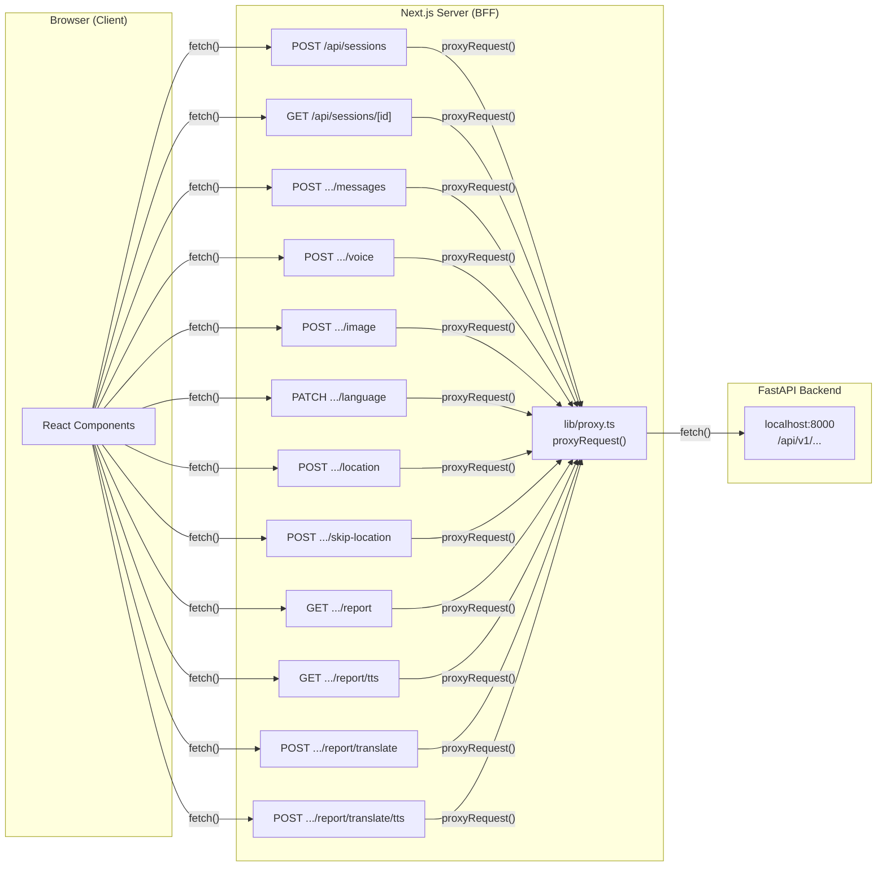
```mermaid
graph LR
    subgraph "Browser (Client)"
        FE["React Components"]
    end
    
    subgraph "Next.js Server (BFF)"
        P["lib/proxy.ts<br/>proxyRequest()"]
        
        R1["POST /api/sessions"]
        R2["GET /api/sessions/[id]"]
        R3["POST .../messages"]
        R4["POST .../voice"]
        R5["POST .../image"]
        R6["PATCH .../language"]
        R7["POST .../location"]
        R8["POST .../skip-location"]
        R9["GET .../report"]
        R10["GET .../report/tts"]
        R11["POST .../report/translate"]
        R12["POST .../report/translate/tts"]
    end
    
    subgraph "FastAPI Backend"
        BE["localhost:8000<br/>/api/v1/..."]
    end
    
    FE -->|"fetch()"| R1 & R2 & R3 & R4 & R5 & R6 & R7 & R8 & R9 & R10 & R11 & R12
    R1 & R2 & R3 & R4 & R5 & R6 & R7 & R8 & R9 & R10 & R11 & R12 -->|"proxyRequest()"| P
    P -->|"fetch()"| BE
```

**proxy.ts** strips `host`, `connection`, `transfer-encoding` headers and forwards everything else. Uses `duplex: "half"` for streaming bodies (Node 18+).

### 6.5 Internationalization (i18n)

| Language | Code | Direction | Native Name | Bundle |
|----------|------|-----------|-------------|--------|
| English | en | LTR | English | en.json |
| French | fr | LTR | Français | fr.json |
| Spanish | es | LTR | Español | es.json |
| Arabic | ar | **RTL** | العربية | ar.json |
| Japanese | ja | LTR | 日本語 | ja.json |
| Swahili | sw | LTR | Kiswahili | sw.json |

**Translation scope:**
- **Translated via i18n (next-intl):** UI labels, buttons, disclaimers, stage names, triage color labels
- **NOT translated (from backend):** Medical conversation text, report content, triage rationale (these are generated in the patient's language by the LLM)

### 6.6 PDF Generation

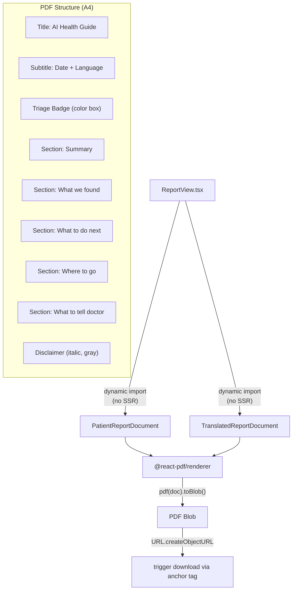
```mermaid
graph TD
    RV["ReportView.tsx"] -->|"dynamic import<br/>(no SSR)"| PDF1["PatientReportDocument"]
    RV -->|"dynamic import<br/>(no SSR)"| PDF2["TranslatedReportDocument"]
    
    PDF1 --> RP["@react-pdf/renderer"]
    PDF2 --> RP
    
    RP -->|"pdf(doc).toBlob()"| Blob["PDF Blob"]
    Blob -->|"URL.createObjectURL"| DL["trigger download via anchor tag"]
    
    subgraph "PDF Structure (A4)"
        T["Title: AI Health Guide"]
        S["Subtitle: Date + Language"]
        TB["Triage Badge (color box)"]
        Sec1["Section: Summary"]
        Sec2["Section: What we found"]
        Sec3["Section: What to do next"]
        Sec4["Section: Where to go"]
        Sec5["Section: What to tell doctor"]
        Disc["Disclaimer (italic, gray)"]
    end
```

### 6.7 Voice & Audio Pipeline

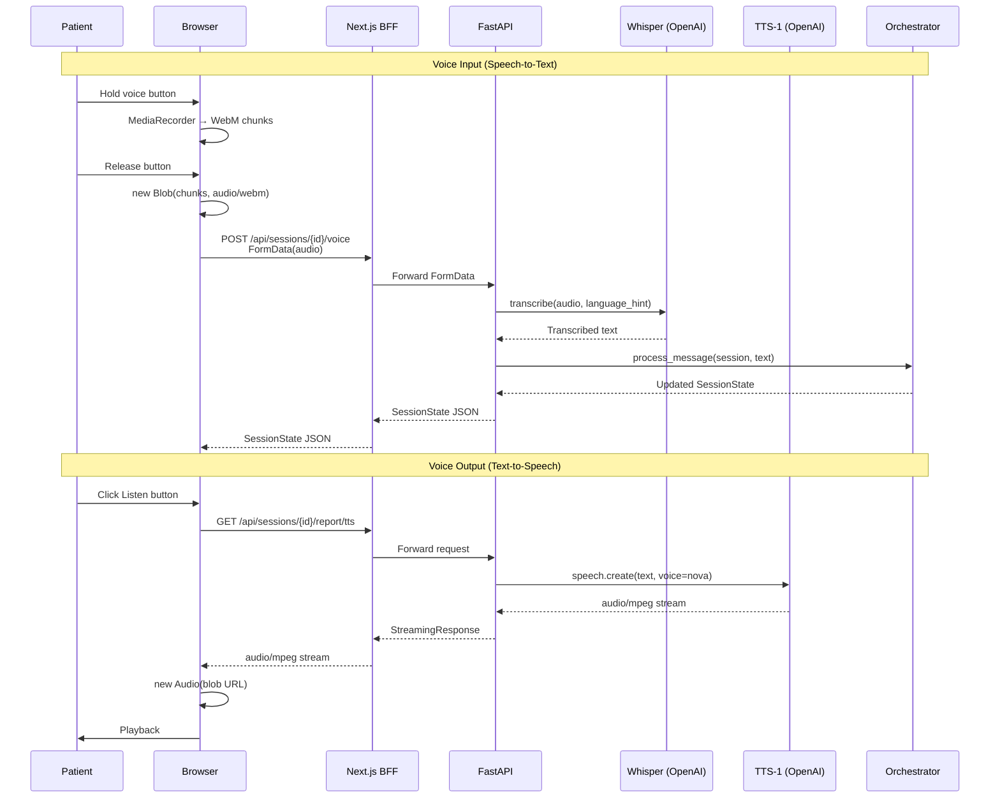
```mermaid
sequenceDiagram
    participant User as Patient
    participant BR as Browser
    participant BFF as Next.js BFF
    participant API as FastAPI
    participant W as Whisper (OpenAI)
    participant TTS as TTS-1 (OpenAI)
    participant O as Orchestrator

    Note over User,O: Voice Input (Speech-to-Text)
    User->>BR: Hold voice button
    BR->>BR: MediaRecorder → WebM chunks
    User->>BR: Release button
    BR->>BR: new Blob(chunks, audio/webm)
    BR->>BFF: POST /api/sessions/{id}/voice<br/>FormData(audio)
    BFF->>API: Forward FormData
    API->>W: transcribe(audio, language_hint)
    W-->>API: Transcribed text
    API->>O: process_message(session, text)
    O-->>API: Updated SessionState
    API-->>BFF: SessionState JSON
    BFF-->>BR: SessionState JSON

    Note over User,O: Voice Output (Text-to-Speech)
    User->>BR: Click Listen button
    BR->>BFF: GET /api/sessions/{id}/report/tts
    BFF->>API: Forward request
    API->>TTS: speech.create(text, voice=nova)
    TTS-->>API: audio/mpeg stream
    API-->>BFF: StreamingResponse
    BFF-->>BR: audio/mpeg stream
    BR->>BR: new Audio(blob URL)
    BR->>User: Playback
```

---

## 7. Data Flows

### 7.1 Complete Consultation Flow

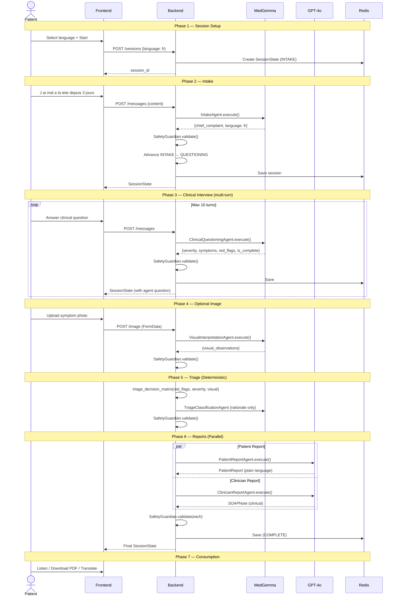
```mermaid
sequenceDiagram
    actor P as Patient
    participant FE as Frontend
    participant BE as Backend
    participant MG as MedGemma
    participant GPT as GPT-4o
    participant R as Redis

    Note over P,R: Phase 1 — Session Setup
    P->>FE: Select language + Start
    FE->>BE: POST /sessions {language: fr}
    BE->>R: Create SessionState (INTAKE)
    BE-->>FE: session_id

    Note over P,R: Phase 2 — Intake
    P->>FE: J ai mal a la tete depuis 3 jours
    FE->>BE: POST /messages {content}
    BE->>MG: IntakeAgent.execute()
    MG-->>BE: {chief_complaint, language: fr}
    BE->>BE: SafetyGuardian.validate()
    BE->>BE: Advance INTAKE → QUESTIONING
    BE->>R: Save session
    BE-->>FE: SessionState

    Note over P,R: Phase 3 — Clinical Interview (multi-turn)
    loop Max 10 turns
        P->>FE: Answer clinical question
        FE->>BE: POST /messages
        BE->>MG: ClinicalQuestioningAgent.execute()
        MG-->>BE: {severity, symptoms, red_flags, is_complete}
        BE->>BE: SafetyGuardian.validate()
        BE->>R: Save
        BE-->>FE: SessionState (with agent question)
    end

    Note over P,R: Phase 4 — Optional Image
    P->>FE: Upload symptom photo
    FE->>BE: POST /image (FormData)
    BE->>MG: VisualInterpretationAgent.execute()
    MG-->>BE: {visual_observations}
    BE->>BE: SafetyGuardian.validate()
    
    Note over P,R: Phase 5 — Triage (Deterministic)
    BE->>BE: triage_decision_matrix(red_flags, severity, visual)
    BE->>MG: TriageClassificationAgent (rationale only)
    BE->>BE: SafetyGuardian.validate()
    
    Note over P,R: Phase 6 — Reports (Parallel)
    par Patient Report
        BE->>GPT: PatientReportAgent.execute()
        GPT-->>BE: PatientReport (plain language)
    and Clinician Report
        BE->>GPT: ClinicianReportAgent.execute()
        GPT-->>BE: SOAPNote (clinical)
    end
    BE->>BE: SafetyGuardian.validate(each)
    BE->>R: Save (COMPLETE)
    BE-->>FE: Final SessionState

    Note over P,R: Phase 7 — Consumption
    P->>FE: Listen / Download PDF / Translate
```

### 7.2 Message Processing Flow

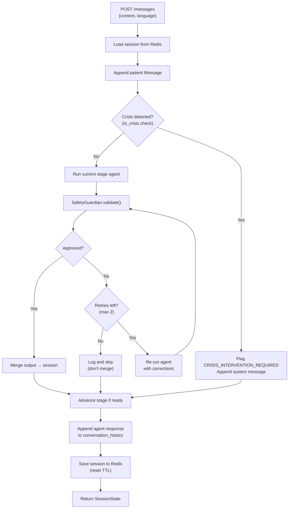
```mermaid
flowchart TD
    A["POST /messages<br/>{content, language}"] --> B["Load session from Redis"]
    B --> C["Append patient Message"]
    C --> D{"Crisis detected?<br/>(is_crisis check)"}
    D -->|Yes| E["Flag CRISIS_INTERVENTION_REQUIRED<br/>Append system message"]
    D -->|No| F["Run current stage agent"]
    
    F --> G["SafetyGuardian.validate()"]
    G --> H{"Approved?"}
    H -->|Yes| I["Merge output → session"]
    H -->|No| J{"Retries left?<br/>(max 2)"}
    J -->|Yes| K["Re-run agent<br/>with corrections"]
    K --> G
    J -->|No| L["Log and skip<br/>(don't merge)"]
    
    I --> M["Advance stage if ready"]
    L --> M
    E --> M
    M --> N["Append agent response<br/>to conversation_history"]
    N --> O["Save session to Redis<br/>(reset TTL)"]
    O --> P["Return SessionState"]
```

### 7.3 Voice Input Flow

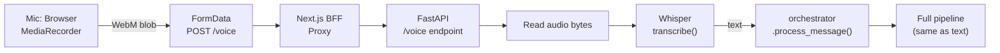
```mermaid
flowchart LR
    A["Mic: Browser<br/>MediaRecorder"] -->|"WebM blob"| B["FormData<br/>POST /voice"]
    B --> C["Next.js BFF<br/>Proxy"]
    C --> D["FastAPI<br/>/voice endpoint"]
    D --> E["Read audio bytes"]
    E --> F["Whisper<br/>transcribe()"]
    F -->|"text"| G["orchestrator<br/>.process_message()"]
    G --> H["Full pipeline<br/>(same as text)"]
```

### 7.4 Image Upload Flow

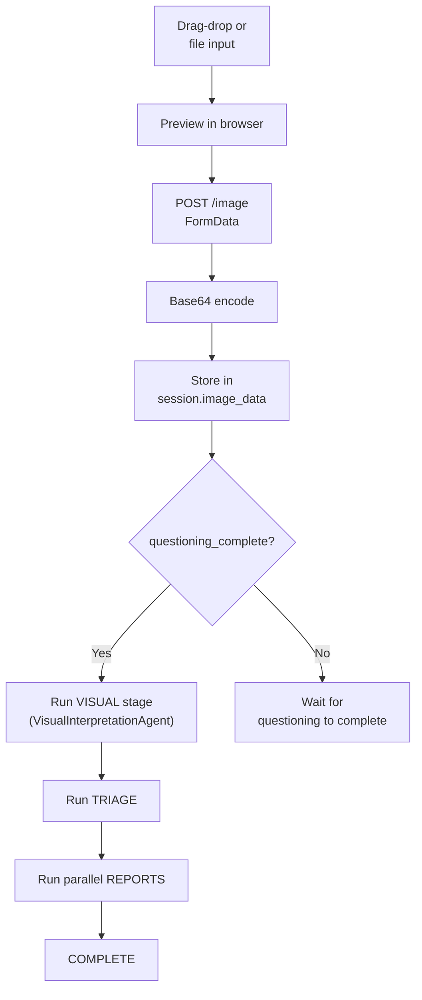
```mermaid
flowchart TD
    A["Drag-drop or<br/>file input"] --> B["Preview in browser"]
    B --> C["POST /image<br/>FormData"]
    C --> D["Base64 encode"]
    D --> E["Store in<br/>session.image_data"]
    E --> F{"questioning_complete?"}
    F -->|Yes| G["Run VISUAL stage<br/>(VisualInterpretationAgent)"]
    G --> H["Run TRIAGE"]
    H --> I["Run parallel REPORTS"]
    I --> J["COMPLETE"]
    F -->|No| K["Wait for<br/>questioning to complete"]
```

### 7.5 Report Translation Flow

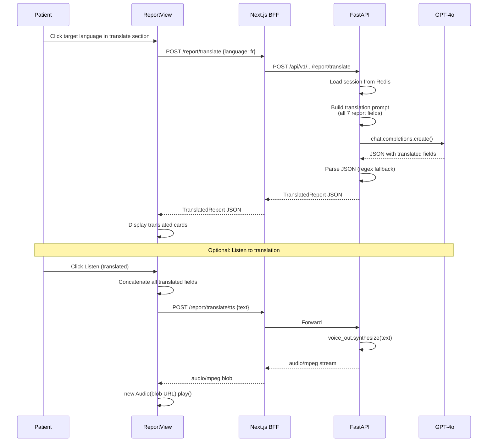
```mermaid
sequenceDiagram
    participant P as Patient
    participant FE as ReportView
    participant BFF as Next.js BFF
    participant API as FastAPI
    participant GPT as GPT-4o

    P->>FE: Click target language in translate section
    FE->>BFF: POST /report/translate {language: fr}
    BFF->>API: POST /api/v1/.../report/translate
    API->>API: Load session from Redis
    API->>API: Build translation prompt<br/>(all 7 report fields)
    API->>GPT: chat.completions.create()
    GPT-->>API: JSON with translated fields
    API->>API: Parse JSON (regex fallback)
    API-->>BFF: TranslatedReport JSON
    BFF-->>FE: TranslatedReport JSON
    FE->>FE: Display translated cards
    
    Note over P,GPT: Optional: Listen to translation
    P->>FE: Click Listen (translated)
    FE->>FE: Concatenate all translated fields
    FE->>BFF: POST /report/translate/tts {text}
    BFF->>API: Forward
    API->>API: voice_out.synthesize(text)
    API-->>BFF: audio/mpeg stream
    BFF-->>FE: audio/mpeg blob
    FE->>FE: new Audio(blob URL).play()
```

### 7.6 TTS Audio Flow

```mermaid
flowchart LR
    A["Click Listen"] --> B{"Original or<br/>Translated?"}
    
    B -->|Original| C["GET /report/tts"]
    C --> D["Backend concatenates<br/>report fields"]
    D --> E["OpenAI TTS-1<br/>voice: nova"]
    E --> F["StreamingResponse<br/>audio/mpeg"]
    
    B -->|Translated| G["POST /report/translate/tts<br/>{text: concatenated}"]
    G --> H["Backend receives text"]
    H --> E
    
    F --> I["Browser creates<br/>Audio object"]
    I --> J["Synchronous playback"]
```

---

## 8. Authentication & Session Management

```mermaid
graph TD
    subgraph "Current State (No Auth)"
        C["Client"] -->|"session_id (UUID)"| API["FastAPI"]
        API -->|"SETEX session:{id}"| Redis["Redis"]
    end
    
    subgraph "Session Lifecycle"
        Create["POST /sessions<br/>→ UUID4 generated"] --> Active["Active (0-2h)"]
        Active -->|"Each interaction<br/>resets TTL"| Active
        Active -->|"No activity<br/>for 2 hours"| Expired["Expired<br/>(auto-deleted)"]
        Active -->|"DELETE /sessions/{id}"| Deleted["Explicitly deleted"]
    end
```

**Current security model:** Session isolation by UUID4 (256-bit entropy). No user authentication, no RBAC. Acceptable for private clinic network deployment with physical access controls.

**Session data stored in Redis:**

| Key | Value | TTL |
|-----|-------|-----|
| `session:{uuid4}` | Full SessionState JSON (~5-50KB) | 7200s (reset on every write) |

---

## 9. Database & Persistence Schema

```mermaid
graph TB
    subgraph "Redis 7 (Session Store)"
        direction TB
        K1["session:a1b2c3d4-...<br/>TTL: 7200s"]
        K2["session:e5f6g7h8-...<br/>TTL: 7200s"]
        K3["session:i9j0k1l2-...<br/>TTL: 7200s"]
    end
    
    subgraph "SessionState JSON Structure"
        Root["SessionState"]
        Root --> Core["Core Fields<br/>session_id, created_at,<br/>current_stage, languages"]
        Root --> History["conversation_history[]<br/>Message objects"]
        Root --> Clinical["Clinical Data<br/>symptoms, severity,<br/>red_flags[], abcde"]
        Root --> Visual["Visual Data<br/>image_data (base64),<br/>observations[]"]
        Root --> Triage["Triage<br/>color, rationale,<br/>facility_type"]
        Root --> Reports["Reports<br/>patient_report,<br/>clinician_report"]
        Root --> Safety["Safety<br/>safety_checks[],<br/>disclaimers_verified"]
    end
```

**No relational database** — Redis is the sole persistence layer. Each session is a self-contained JSON document. No cross-session queries, analytics, or historical data retention beyond the 2-hour TTL.

---

## 10. Design Patterns

### Pattern Inventory

| Pattern | Where Used | Description |
|---------|-----------|-------------|
| **Pipeline / Chain of Responsibility** | `SessionOrchestrator` | 6-stage sequential agent pipeline with conditional stage skipping |
| **Strategy (via ABC)** | `BaseAgent` → concrete agents | Each agent implements `execute()` with stage-specific logic |
| **Backend for Frontend (BFF)** | Next.js `api/` routes | Frontend proxies all API calls, hiding backend URL from client |
| **Observer (Polling)** | `useSessionPolling` hook | Client polls for state changes every 2s |
| **State Machine** | `Stage` enum + orchestrator | Deterministic stage transitions driven by session data conditions |
| **Decorator / Cross-Cutting Concern** | `SafetyGuardian` | Validates every agent output before merging |
| **Retry with Correction** | Orchestrator safety loop | Failed safety → re-run agent with correction instructions (max 2) |
| **Repository** | `RedisSessionClient` | Abstract persistence behind save/load/delete interface |
| **Parallel Execution** | `asyncio.gather` in reports | Patient + clinician reports generated concurrently |
| **Proxy** | `lib/proxy.ts` | BFF forwards requests with header filtering |
| **Composition** | Zustand stores | Session and UI concerns separated into independent stores |
| **Dynamic Import** | PDF components | `@react-pdf/renderer` loaded client-side only to avoid SSR issues |

### Anti-Patterns & Design Smells

| Smell | Location | Impact | Severity |
|-------|----------|--------|----------|
| **God Object** | `SessionState` (68 lines, 20+ fields) | All pipeline data in one model | Low (acceptable for session-scoped data) |
| **Polling instead of WebSocket** | `useSessionPolling` (2s interval) | Unnecessary network traffic | Medium |
| **Global mutable state** | `main.py` global vars | Testing difficulty | Medium |
| **No dependency injection** | Agent constructors | Hard-coded client references | Low |
| **Base64 image in session** | `session.image_data` | Large JSON documents in Redis | Medium |

---

## 11. Feature Inventory (Product Manager View)

### Core Features

| # | Feature | Status | Priority | Description |
|---|---------|--------|----------|-------------|
| F1 | Multilingual welcome | ✅ Live | P0 | Language selection before consultation (6 languages) |
| F2 | Chief complaint intake | ✅ Live | P0 | Extract complaint + auto-detect language |
| F3 | ABCDE clinical interview | ✅ Live | P0 | Structured multi-turn medical history (max 10 turns) |
| F4 | Red flag screening | ✅ Live | P0 | 13 critical/high/moderate flags scanned per message |
| F5 | Symptom image upload | ✅ Live | P1 | Photo upload with drag-drop, skip option |
| F6 | Visual interpretation | ✅ Live | P1 | MedGemma multimodal image analysis (no diagnosis) |
| F7 | Deterministic triage | ✅ Live | P0 | Rule-based RED/YELLOW/GREEN (never LLM-dependent) |
| F8 | Patient report | ✅ Live | P0 | Plain-language summary via GPT-4o in patient's language |
| F9 | Clinician SOAP note | ✅ Live | P0 | Clinical report in English for healthcare provider |
| F10 | Voice input (STT) | ✅ Live | P1 | Whisper transcription with language hint |
| F11 | Voice output (TTS) | ✅ Live | P1 | Report read-aloud via OpenAI TTS (nova voice) |
| F12 | Report translation | ✅ Live | P1 | Translate patient report to any of 6 languages |
| F13 | Translated report TTS | ✅ Live | P2 | Listen to translated report |
| F14 | PDF export (original) | ✅ Live | P1 | A4 PDF with triage badge, all sections |
| F15 | PDF export (translated) | ✅ Live | P2 | PDF for translated report |
| F16 | Safety guardian | ✅ Live | P0 | Cross-cutting validator at every stage |
| F17 | Crisis detection | ✅ Live | P0 | Suicidal ideation triggers immediate intervention |
| F18 | RTL support | ✅ Live | P1 | Arabic (ar) layout direction support |
| F19 | Progress visualization | ✅ Live | P2 | 5-step progress bar with review of past stages |
| F20 | New consultation | ✅ Live | P2 | Reset and start fresh |
| F21 | Landing home page | ✅ Live | P1 | Full marketing/onboarding page with hero, features, agent orchestration animation, testimonials |
| F22 | Agent activity panel | ✅ Live | P2 | Real-time pipeline status during processing (replaces generic spinners) |
| F23 | Nearby facilities | ✅ Live | P1 | GPS-based facility search via Google Maps with external direction links |

### Updated Feature: Care Navigation

| Feature | Status | Description |
|---------|--------|-------------|
| Google Maps facility search | ✅ Active | Backend `google_maps.py` searches nearby facilities using Google Places API, ranked by composite score (proximity 0.6 + rating 0.3 + open status 0.1). Includes `open_now` fallback — tries open facilities first, falls back to all if none found. |
| Geolocation + directions | ✅ Active | `NearbyFacilities` component requests GPS permission, displays facility cards with distance/rating, and provides external Google Maps direction links (no embedded map). |
| Backend error handling | ✅ Active | Location endpoint includes structured error logging for both `places_nearby` and `get_directions` failures. |

### Feature Gaps (Product Roadmap Candidates)

| Gap | Impact | Effort |
|-----|--------|--------|
| User authentication | High (security) | Medium |
| Session history / analytics | High (clinic ops) | High |
| WebSocket real-time updates | Medium (UX) | Medium |
| Offline mode (PWA) | Medium (field clinics) | High |
| Multi-provider support | Medium (scalability) | Low |
| Clinician dashboard | High (workflow) | High |
| Audit trail / compliance logging | High (healthcare regs) | Medium |
| Rate limiting | Medium (abuse prevention) | Low |
| Dark mode toggle | Low (UX) | Low |

---

## 12. Technical Debt & Observations

### Critical Debt

| # | Issue | File(s) | Severity | Recommendation |
|---|-------|---------|----------|----------------|
| TD1 | **API keys in .env committed to repo** | `.env` | 🔴 Critical | Rotate keys immediately; use secrets manager; add `.env` to `.gitignore` |
| TD2 | **No CI/CD pipeline** | (missing `.github/`) | 🔴 Critical | Add GitHub Actions for lint, test, security scan |
| TD3 | **No authentication on API** | `main.py` | 🟡 High | Add session tokens, HMAC validation, or OAuth |
| TD4 | **CORS allows all origins** | `main.py` CORS middleware | 🟡 High | Restrict to frontend domain(s) |

### Moderate Debt

| # | Issue | File(s) | Severity | Recommendation |
|---|-------|---------|----------|----------------|
| TD5 | **Base64 images in session JSON** | `session.py`, `main.py` | 🟡 Medium | Store images in object storage (S3/MinIO), reference by URL |
| TD6 | **Polling instead of WebSocket** | `useSessionPolling.ts` | 🟡 Medium | Implement WebSocket or SSE for real-time updates |
| TD7 | **Global mutable state in main.py** | `main.py` (5 globals) | 🟡 Medium | Use FastAPI dependency injection |
| TD8 | **leaflet + react-leaflet installed but unused** | `package.json` | 🟢 Low | Remove if not needed, or integrate for map display |
| TD11 | **requirements.txt includes unused packages** | `requirements.txt` | 🟢 Low | Remove `transformers`, `torch`, `accelerate` (using Ollama now) |
| TD12 | **Frontend .env.local has unused Google Maps client key** | `.env.local` | 🟢 Low | Remove `NEXT_PUBLIC_GOOGLE_MAPS_API_KEY` (Google Maps is server-side only via Python `googlemaps` client) |
| TD13 | **Missing structured logging** | All backend files | 🟡 Medium | Add structlog or loguru with correlation IDs |
| TD14 | **No request ID / correlation ID** | `main.py` | 🟡 Medium | Add middleware for tracing |
| TD15 | **No rate limiting** | `main.py` | 🟡 Medium | Add slowapi or similar |
| TD16 | **No Dockerfile / docker-compose** | Root | 🟡 Medium | Add containerization for reproducible deployment |
| TD17 | **Next.js config is empty** | `next.config.mjs` | 🟢 Low | Configure security headers, image optimization |
| TD18 | **No health check for Ollama** | `main.py` `/health` | 🟢 Low | Add MedGemma availability to health endpoint |

### Dependency Notes

**Backend — unused but installed:**
- `transformers>=4.40.0` — Was for local HuggingFace inference (now using Ollama)
- `torch>=2.2.0` — Same reason
- `accelerate>=0.28.0` — Same reason

**Frontend — unused but installed:**
- `leaflet` / `react-leaflet` — installed but not actively used in current components

---

## 13. Security Posture

### Current Vulnerabilities

```mermaid
graph TD
    subgraph "Critical"
        V1["API keys committed<br/>to .env in repo"]
        V2["No authentication<br/>on any endpoint"]
    end
    
    subgraph "High"
        V3["CORS: allow all origins"]
        V4["Redis no password"]
        V5["No rate limiting"]
        V6["No input validation<br/>on message length"]
    end
    
    subgraph "Mitigated by Design"
        V7["Deterministic triage<br/>(LLM cannot change color)"]
        V8["Safety Guardian<br/>(blocks diagnostic language)"]
        V9["Crisis detection<br/>(suicide keyword scanning)"]
        V10["Disclaimer enforcement<br/>(reports must include)"]
    end
```

### Security Controls in Place

| Control | Implementation | Coverage |
|---------|---------------|----------|
| **No diagnostic language** | `FORBIDDEN_PATTERNS` regex (7 patterns) | All patient-facing text |
| **Deterministic triage** | `triage_decision_matrix()` (rule-based) | Triage classification |
| **Red flag escalation** | Safety Guardian validation | Triage stage |
| **Crisis detection** | `is_crisis()` keyword matching | Every patient message |
| **Disclaimer enforcement** | `disclaimer_checker.py` | Patient reports |
| **Session isolation** | UUID4 (256-bit entropy) | Session access |
| **Session expiration** | Redis TTL (2 hours) | Data retention |
| **BFF proxy** | `lib/proxy.ts` hides backend URL | API exposure |

### Security Recommendations

1. **Immediate:** Rotate all API keys, move to environment-only secrets
2. **Short-term:** Add authentication (JWT/session tokens), restrict CORS origins
3. **Medium-term:** Add rate limiting, request logging, audit trail
4. **Long-term:** HIPAA compliance audit, encryption at rest, access controls

---

## 14. Testing Strategy

### Current Test Coverage

```mermaid
graph TD
    subgraph "Backend (pytest)"
        T1["test_triage_matrix.py<br/>11 tests"]
        T2["test_red_flags.py<br/>13 tests"]
        T3["test_session_flow.py<br/>10 tests"]
        T4["test_safety_guardian.py<br/>6 tests"]
        Total["Total: ~40 unit tests"]
    end
    
    subgraph "Frontend (not yet implemented)"
        T5["Vitest — unit<br/>(configured, no tests)"]
        T6["Playwright — E2E<br/>(configured, no tests)"]
    end
```

**Tested areas:**
- Triage decision matrix (all color paths, edge cases, facility mapping)
- Red flag screening (all 13 flags, crisis detection, case sensitivity)
- Session state transitions (stage advancement rules, turn counting)
- Safety Guardian (forbidden patterns, escalation enforcement, disclaimer checking)

**Untested areas:**
- All agents (intake, questioning, visual, triage, report) — no integration tests
- API endpoints — no HTTP-level tests
- Voice pipeline — no STT/TTS tests
- Translation — no tests
- Frontend components — no unit or snapshot tests
- End-to-end flow — no Playwright tests

### Testing Gaps

| Gap | Priority | Impact |
|-----|----------|--------|
| Agent integration tests | High | Cannot verify LLM output handling |
| API endpoint tests | High | Cannot verify request/response contracts |
| Frontend unit tests | Medium | No regression protection for UI |
| E2E tests | Medium | No full-flow verification |
| Load testing | Low | Unknown concurrent session capacity |

---

## 15. Deployment Architecture

### Current (Development)

```mermaid
graph TB
    subgraph "Developer Machine"
        FE["Next.js Dev Server<br/>localhost:3000"]
        BE["Uvicorn Dev Server<br/>localhost:8000"]
        OL["Ollama Server<br/>localhost:11434"]
        RD["Redis Docker<br/>localhost:6379"]
    end
    
    subgraph "Cloud APIs"
        OAI["OpenAI API<br/>(GPT-4o, Whisper, TTS)"]
    end
    
    FE --> BE
    BE --> OL
    BE --> RD
    BE --> OAI
```

### Recommended Production

```mermaid
graph TB
    subgraph "Edge / CDN"
        CF["Cloudflare / Vercel Edge<br/>Static assets + caching"]
    end
    
    subgraph "Application Layer"
        FE["Next.js<br/>(Vercel / Docker)"]
        BE["FastAPI<br/>(Docker / Azure Container Apps)"]
    end
    
    subgraph "AI Layer"
        OL["Ollama<br/>(GPU VM / dedicated)"]
    end
    
    subgraph "Data Layer"
        RD["Redis Cluster<br/>(Azure Cache / ElastiCache)"]
    end
    
    subgraph "Secrets"
        KV["Key Vault / Secrets Manager"]
    end
    
    subgraph "External"
        OAI["OpenAI API"]
    end
    
    CF --> FE
    FE --> BE
    BE --> OL
    BE --> RD
    BE --> OAI
    BE --> KV
```

**Missing for production:**
- Dockerfile / docker-compose
- CI/CD pipeline
- TLS/HTTPS configuration
- Reverse proxy (nginx/caddy)
- Health check endpoints for orchestration
- Log aggregation / APM
- Backup strategy for Redis (AOF/RDB)

---

## 16. Appendices

### Appendix A: All Backend Constants

| Constant | Value | File |
|----------|-------|------|
| `MAX_SAFETY_RETRIES` | `2` | `orchestrator.py` |
| `SESSION_TTL` | `7200` (2 hours) | `redis_client.py` |
| `KEY_PREFIX` | `"session:"` | `redis_client.py` |
| `medgemma_model_name` | `"MedAIBase/MedGemma1.0:4b"` | `config.py` |
| `medgemma_temperature` | `0.3` | `config.py` |
| `medgemma_max_tokens` | `4096` | `config.py` |
| `max_questioning_turns` | `10` | `config.py` |
| `max_session_duration_minutes` | `30` | `config.py` |
| `POLL_INTERVAL_MS` | `2000` | `useSessionPolling.ts` |
| `RED_FLAG_DATABASE` | 13 entries | `red_flag_screening.py` |
| `FORBIDDEN_PATTERNS` | 7 regex patterns | `safety_guardian.py` |

### Appendix B: All Models & Types

**Python (Pydantic v2):**
```
models/session.py:   Stage, Message, Location, Facility, SessionState
models/clinical.py:  TriageColor, RedFlag, ABCDEAssessment, TriageResult
models/report.py:    PatientReport, SOAPNote, FinalReport
models/safety.py:    SafetyCheckResult
```

**TypeScript (mirrors):**
```
types/session.ts:    Stage, TriageColor, Message, RedFlag, ABCDEAssessment,
                     TriageResult, PatientReport, SOAPNote, SafetyCheckResult,
                     SessionState, CreateSessionResponse
```

### Appendix C: Triage Color System

| Color | Hex | Urgency | Facility | Tailwind Classes |
|-------|-----|---------|----------|-----------------|
| RED | `#DC2626` | Emergency — Go Now | Emergency Department | `bg-red-50 text-red-800 border-red-200` |
| YELLOW | `#F59E0B` | Urgent — Within 24h | Urgent Care | `bg-yellow-50 text-yellow-800 border-yellow-200` |
| GREEN | `#16A34A` | Non-Urgent — Schedule | Clinic / GP | `bg-green-50 text-green-800 border-green-200` |

### Appendix D: Supported Languages

| Language | ISO | Native | Direction | Detection | i18n | Backend |
|----------|-----|--------|-----------|-----------|------|---------|
| English | en | English | LTR | lingua | ✅ | ✅ |
| French | fr | Français | LTR | lingua | ✅ | ✅ |
| Spanish | es | Español | LTR | lingua | ✅ | ✅ |
| Arabic | ar | العربية | **RTL** | lingua | ✅ | ✅ |
| Japanese | ja | 日本語 | LTR | lingua | ✅ | ✅ |
| Swahili | sw | Kiswahili | LTR | lingua | ✅ | ✅ |

### Appendix E: Environment Variables

| Variable | Required | Default | Description |
|----------|----------|---------|-------------|
| `MEDGEMMA_MODEL_NAME` | No | `MedAIBase/MedGemma1.0:4b` | Ollama model ID |
| `MEDGEMMA_OLLAMA_BASE_URL` | No | `http://localhost:11434` | Ollama server URL |
| `MEDGEMMA_MAX_TOKENS` | No | `4096` | Max output tokens |
| `MEDGEMMA_TEMPERATURE` | No | `0.3` | LLM temperature |
| `OPENAI_API_KEY` | **Yes** | — | OpenAI API key (reports, voice) |
| `OPENAI_REPORT_MODEL` | No | `gpt-4o` | Report generation model |
| `WHISPER_MODEL` | No | `whisper-1` | Speech-to-text model |
| `TTS_MODEL` | No | `tts-1` | Text-to-speech model |
| `TTS_VOICE` | No | `nova` | TTS voice |
| `GOOGLE_MAPS_API_KEY` | No | — | Google Maps Places + Directions (active for facility search) |
| `REDIS_URL` | No | `redis://localhost:6379` | Redis connection URL |
| `REDIS_PASSWORD` | No | — | Redis password |
| `MAX_QUESTIONING_TURNS` | No | `10` | Max clinical interview turns |
| `MAX_SESSION_DURATION_MINUTES` | No | `30` | Max session duration |
| `SUPPORTED_LANGUAGES` | No | `["en","fr","ja","ar","sw","es"]` | Allowed languages |
| `DEFAULT_CLINICAL_LANGUAGE` | No | `en` | Default for clinical notes |
| `BACKEND_URL` | No | `http://localhost:8000` | Frontend → Backend URL |

### Appendix F: Dependency Inventory

**Backend (requirements.txt):**

| Package | Version | Status | Purpose |
|---------|---------|--------|---------|
| fastapi | ≥0.111.0 | Active | REST API framework |
| uvicorn[standard] | ≥0.29.0 | Active | ASGI server |
| python-multipart | ≥0.0.9 | Active | File upload parsing |
| pydantic | ≥2.0.0 | Active | Data validation |
| pydantic-settings | ≥2.0.0 | Active | Config management |
| redis | ≥5.0.0 | Active | Session persistence |
| openai | ≥1.30.0 | Active | GPT-4o, Whisper, TTS |
| httpx | ≥0.27.0 | Active | Ollama HTTP client |
| lingua-language-detector | ≥2.0.0 | Active | Offline language ID |
| googlemaps | ≥4.10.0 | Active | Google Maps Places + Directions for facility search |
| transformers | ≥4.40.0 | Legacy | Unused (using Ollama) |
| torch | ≥2.2.0 | Legacy | Unused (using Ollama) |
| accelerate | ≥0.28.0 | Legacy | Unused (using Ollama) |
| pytest | ≥8.0.0 | Active | Testing |
| pytest-asyncio | ≥0.23.0 | Active | Async test support |

**Frontend (package.json):**

| Package | Version | Status | Purpose |
|---------|---------|--------|---------|
| next | 14.2.35 | Active | App framework |
| react / react-dom | ^18 | Active | UI library |
| zustand | ^5.0.12 | Active | State management |
| next-intl | ^4.8.3 | Active | Internationalization |
| tailwindcss | ^3.4.1 | Active | CSS framework |
| @react-pdf/renderer | ^4.3.2 | Active | PDF generation |
| clsx | ^2.1.1 | Active | Class composition |
| tailwind-merge | ^3.0.2 | Active | Class deduplication |
| leaflet | ^1.9.4 | Installed | Map rendering library |
| react-leaflet | ^4.2.1 | Installed | React wrapper for Leaflet |
| typescript | ^5 | Active | Type safety |
| vitest | ^4.1.0 | Active | Unit testing |
| @playwright/test | ^1.58.2 | Active | E2E testing |

---

*Generated by comprehensive codebase audit*
